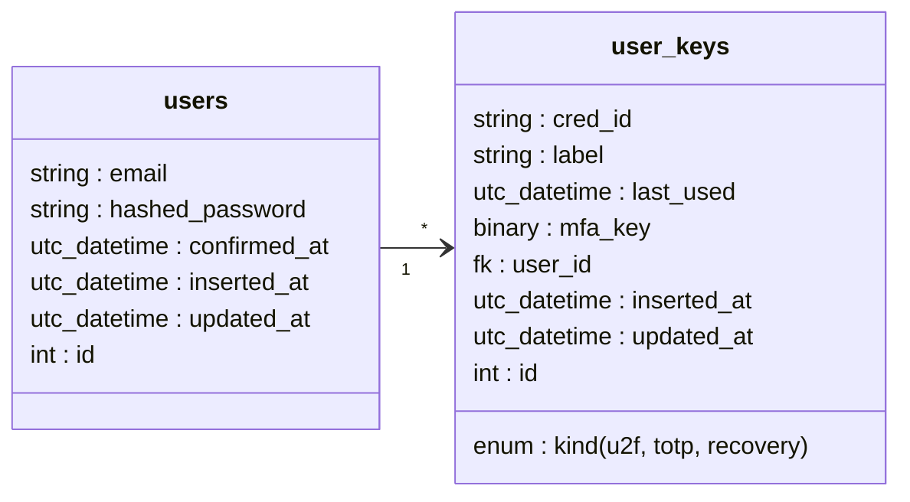

# Phoenix2FA

Simple 2FA for Phoenix, built on top of the Phoenix generated authentication system.
- Uses [Wax](https://hexdocs.pm/wax_/readme.html) for Fido2/U2f/WebAthn
- Uses [NimbleTOTP]() for TOTP
- Generated recovery codes randomly using [`:crypto.strong_rand_bytes/1`](https://www.erlang.org/doc/man/crypto.html#strong_rand_bytes-1)

## Database 

## Setup

  * Run `mix setup` to install and setup dependencies
  * Start Phoenix endpoint with `mix phx.server` or inside IEx with `iex -S mix phx.server`

Now you can visit [`localhost:4000`](http://localhost:4000) from your browser.
