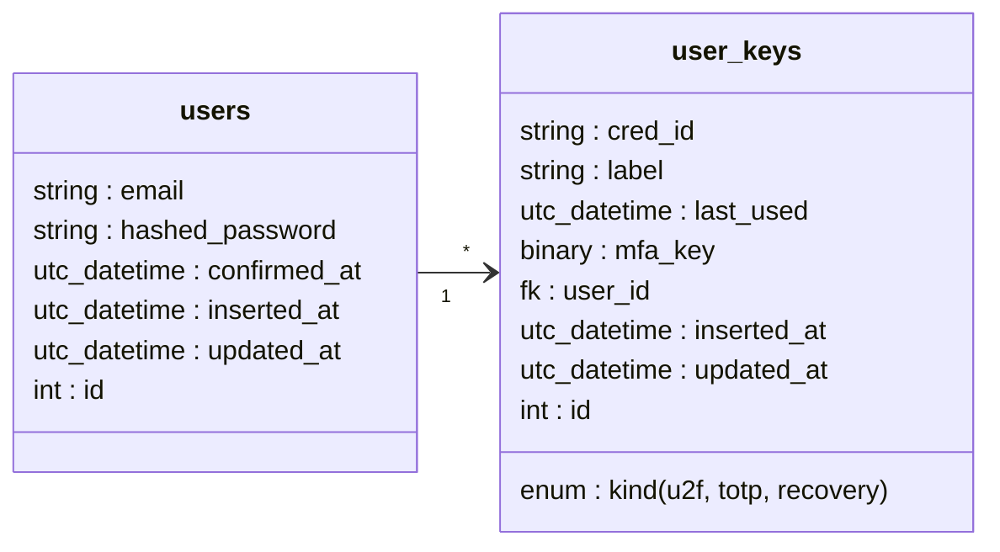

# Phoenix2FA

https://github.com/guessthepw/phoenix-2fa/assets/26552444/c984f86e-4d5e-48cd-af83-c9e89d60c8bc

Phoenix2FA is a simple two-factor authentication (2FA) system built on top of the Phoenix-generated Auth System, and meant to serve as an example. It has support for registration and authentication for three different key types:

- `:totp` - Time-based One-time Password (Google Authenticator, QR Code etc)
  - Uses [NimbleTOTP](<[hexdocs.pm/nimble_totp](https://hexdocs.pm/nimble_totp)>) for TOTP (Time-based One-Time Password)
- `:u2f` - Universal 2nd Factor , physical device
  - Uses [Wax](https://hexdocs.pm/wax_/readme.html)
- `:recovery` - List of x digits given to user, one time use, used as last resort
  - - Generated backup recovery codes randomly using [`:crypto.strong_rand_bytes/1`](https://www.erlang.org/doc/man/crypto.html#strong_rand_bytes-1)

I used the commands:

- `mix phx.new phoenix_2fa`
- `mix phx.gen.auth Accounts User users`
- `mix phx.gen.html Accounts UserKey user_keys cred_id:string label:string last_used:utc_datetime mfa_key:binary kind:enum:u2f:totp:recovery user_id:references:users`
- Then made additional changes.

### Built With

- Postgres - ~ 15.2
- erlang - ~ 26.0.1
- Elixir - ~ 1.14.5-otp-26
- Phoenix - ~ 1.7.3
- Phoenix LiveView - ~ 0.19.1
- NodeJS - ~ 19.3.0

## TODO

- Switch to LiveViews
- Additional tests / docs
- PRS Welcome

## Database changes

We need an additional table to track the three different kinds of user keys we have.

## Setup

- Run `mix setup` to install and setup dependencies
- Start Phoenix endpoint with `mix phx.server` or inside IEx with `iex -S mix phx.server`

Now you can visit [`localhost:4000`](http://localhost:4000) from your browser.

## Further Resources

- [https://www.w3.org/TR/webauthn-2](https://www.w3.org/TR/webauthn-2)
- [https://webauthn.guide](https://webauthn.guide/)
- [https://developer.mozilla.org/en-US/docs/Web/API/PublicKeyCredential](https://developer.mozilla.org/en-US/docs/Web/API/PublicKeyCredential)
- Inspired by this [elixir conf talk](https://www.youtube.com/watch?v=krbriAecqUk)

## Security considerations (taken from [Wax](https://github.com/tanguilp/wax))

Make sure to understand the implications of not using attested credentials before accepting none or self attestation types, or disabling it for packed and u2f formats by disabling it with the verify_trust_root option
